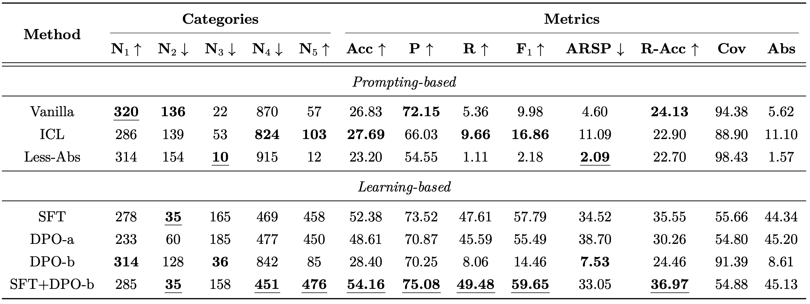

# 自然语言学大作业：大模型的知识边界
小组成员：汤宸名 陈智扬 汪思涵

## 目录结构
- `data`存放数据，以JSON格式存储。
- `model`存放模型，本地存放即可，不用推送到Git（在`.gitignore`中也已写上）。模型路径统一存为`model/meta-llama/Llama-3.2-3B-Instruct`。
- `src`存放源代码，使用Python为主要语言。
- `result`存放实验结果。

## 环境说明
- 软件要求：`requirements.txt`。
- 硬件要求：`NVIDIA A100 80GB PCIe`。

## 知识边界探查
- 基于回答正误：将模型回答结果与数据集的答案标签对比，回答正确的视作模型掌握的知识，回答错误的视作模型未掌握的知识。
- 基于直接提问：直接询问模型是否知道某个问题的答案。模型回答知道，且模型能回答正确的，视作模型掌握的知识；否则，视作模型未掌握的知识。
- 基于置信度：对模型输出的结果的置信度进行评估。置信度高于一定阈值，且答案正确的，视作模型掌握的知识；否则，视作模型未掌握的知识。
- 基于不确定性：对模型输出的结果的不确定性进行评估。不确定性低于一定阈值，且回答正确的，视作模型掌握的知识；否则，视作模型未掌握的知识。
- 基于多种prompt的综合置信度：使用多种prompt得到模型的多个输出的置信度进行评估。
- 基于多种温度下decoding综合置信度：使用多个temperature下模型的多个输出的置信度进行评估。

## 知识边界应用
```bash
sh application.sh
```
### 让大模型在不知道的时候回答“不知道”
- 直接Prompt：直接让模型在不知道的时候回答“不知道”。
- 上下文学习（ICL）：从训练集中给出4个上下文样例，其中模型知道的样例直接回答正确答案，模型不知道的样例回答“不知道”。
- 有监督微调（SFT）：模型知道的样例目标为输出正确答案。模型不知道的样例目标为输出“不知道”。
- 直接偏好优化（DPO）：模型知道的样例：**正确答案>错误答案**。模型不知道的样例：**“不知道”>任何答案**。
### 避免知道的知识被错回复为“不知道
- 直接Prompt：让模型在不知道的时候回答“不知道”。让模型在知道的时候不要回答“不知道”。
- 直接偏好优化（DPO）：模型知道的样例：**正确答案>错误答案**，**任何答案>“不知道”**。模型不知道的样例：**“不知道”>任何答案**。
- 在SFT模型基础上的直接偏好优化（SFT+DPO）：从前述SFT的模型参数开始进行上述DPO优化。

## 测评指标
- ACC：模型按期望输出的准确率。
- Precision：回答“不知道”中真的“不知道”的比例。
- Recall：“不知道”的问题回答“不知道”的比例。
- F1：综合了Precision和Recall。
- Coverage：所有问题中正面回答的比例。
- Abstention Rate：所有问题中回答“不知道”的比例。
- ARSP：知道的问题回答“不知道”的比例，即over-refusal的比例。
- Reliable-ACC：正面回答的问题中可信回答的比例。

## 实验结果
